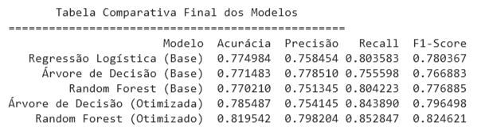

# 📈 Previsão de Churn de Clientes com PySpark

## 🎯 Objetivo do Projeto

O objetivo deste projeto é desenvolver um modelo de Machine Learning robusto, utilizando Apache Spark, para prever a probabilidade de um cliente cancelar seu serviço (churn). A análise e modelagem foram feitas sobre uma base de dados de marketing, demonstrando um fluxo de trabalho completo de ponta a ponta, desde o pré-processamento dos dados até a otimização de hiperparâmetros e a aplicação do modelo final.

## 📊 Dataset

O conjunto de dados utilizado contém informações demográficas e de contrato de clientes de uma empresa de telecomunicações. Ele está disponível neste repositório como um arquivo compactado.

* **Link para os dados:** [base de dados.zip](base%20de%20dados.zip)

## 💻 Tecnologias Utilizadas

* **Apache Spark (PySpark):** Para processamento distribuído e modelagem de Machine Learning.
* **Python 3:** Linguagem de programação principal.
* **Jupyter Notebook:** Ambiente de desenvolvimento interativo.
* **Pandas:** Para a criação e exibição de tabelas comparativas de resultados.

## 🚀 Metodologia

O projeto foi estruturado seguindo as melhores práticas de ciência de dados, cobrindo as seguintes etapas:

1.  **Análise Exploratória e Pré-processamento:** Carregamento dos dados, verificação do balanceamento da variável alvo (`Churn`) e análise inicial dos tipos de dados.
2.  **Engenharia de Features:** Transformação de variáveis categóricas (binárias e multinomiais) em formato numérico através de técnicas de binarização e dummização (`pivot`).
3.  **Modelagem:** Treinamento de três algoritmos de classificação distintos para estabelecer uma linha de base de performance:
    * Regressão Logística
    * Árvore de Decisão
    * Random Forest
4.  **Otimização de Hiperparâmetros:** Utilização de `CrossValidator` e `ParamGridBuilder` para realizar o *tuning* dos modelos de Árvore de Decisão e Random Forest, buscando a melhor combinação de parâmetros para maximizar a performance.
5.  **Avaliação Centralizada:** Criação de uma função (`gerar_relatorio_avaliacao`) para avaliar de forma padronizada todos os modelos, gerando a matriz de confusão e as principais métricas.
6.  **Comparação e Seleção do Melhor Modelo:** Geração de uma tabela comparativa final com os resultados de todos os modelos para selecionar o de melhor performance.
7.  **Aplicação do Modelo Final:** Demonstração prática do uso do modelo selecionado para prever o churn de um novo cliente hipotético.

## 🔧 Como Executar o Projeto

Para executar este projeto em seu ambiente local ou na nuvem (como Google Colab), siga os passos abaixo:

1.  Clone ou faça o download deste repositório.
2.  Extraia o arquivo `base de dados.zip` para obter o arquivo `dados_clientes.csv`.
3.  Certifique-se de que seu ambiente tenha o PySpark e o Pandas instalados.
    ```bash
    pip install pyspark pandas
    ```
4.  Abra o notebook `previsao_churn.ipynb` e execute as células sequencialmente.

## 🏆 Resultados

O modelo final, um **Random Forest Classifier com hiperparâmetros otimizados**, alcançou a melhor performance na previsão de churn, com uma **Acurácia de 81.95%** e um **F1-Score de 0.8246** nos dados de teste.

### Tabela Comparativa dos Modelos

A imagem abaixo resume a performance de todos os modelos avaliados neste projeto.



## 🙏 Agradecimentos

Este projeto foi desenvolvido como parte do curso **Spark: modelos de classificação** da [Alura](https://www.alura.com.br/). Gostaria de agradecer a toda a equipe da Alura pelo excelente conteúdo e, em especial, ao tutor **Igor Nascimento Alves** pelo suporte e mentoria.

## Contato

**Sthefanie Otaviano**

[](http://linkedin.com/in/sthefanie-ferreira-de-s-d-otaviano-976a59206)
